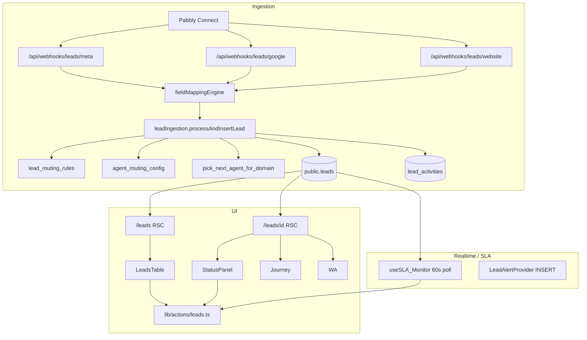

# IGNITE — Sales & Lead Management Module

> **Document purpose:** Pixel-level reference for the current Atlas **Sales / CRM / Lead Management** system — written as if onboarding a new module owner.  
> **Sources scanned:** Main codebase (`/Users/alam/Desktop/Indulge-Atlas`) + snapshot folder `onbording-code/` (parallel copy of leads/sales paths; behavior matches production unless noted).  
> **Last compiled:** 2026-05-19

---

## Table of contents

1. [Module identity](#1-module-identity)
2. [Four business domains (+ global)](#2-four-business-domains--global)
3. [Department & route access (sales surfaces)](#3-department--route-access-sales-surfaces)
4. [Architecture overview](#4-architecture-overview)
5. [Database schema](#5-database-schema)
6. [Lead pipeline & status machine](#6-lead-pipeline--status-machine)
7. [Ingestion: Pabbly, webhooks, Meta](#7-ingestion-pabbly-webhooks-meta)
8. [Assignment: routing rules & agent waterfall](#8-assignment-routing-rules--agent-waterfall)
9. [Server actions API](#9-server-actions-api)
10. [Routes & pages](#10-routes--pages)
11. [UI: Leads index (`/leads`)](#11-ui-leads-index-leads)
12. [UI: Lead dossier (`/leads/[id]`)](#12-ui-lead-dossier-leadsid)
13. [Component catalog (`components/leads/`)](#13-component-catalog-componentsleads)
14. [Supporting UI outside `components/leads/`](#14-supporting-ui-outside-componentsleads)
15. [SLA & escalations](#15-sla--escalations)
16. [Collaborators & cross-domain access](#16-collaborators--cross-domain-access)
17. [Agent dashboard widgets](#17-agent-dashboard-widgets)
18. [Manager & admin surfaces](#18-manager--admin-surfaces)
19. [Onboarding conversion (adjacent)](#19-onboarding-conversion-adjacent)
20. [Environment variables](#20-environment-variables)
21. [Migration index (lead-related)](#21-migration-index-lead-related)
22. [Known quirks & tech debt](#22-known-quirks--tech-debt)
23. [`onbording-code/` snapshot notes](#23-onbording-code-snapshot-notes)

---

## 1. Module identity

**IGNITE** (internal name for this doc) is Atlas’s **inbound sales CRM**: capture leads from ads/forms, assign agents, enforce speed-to-lead SLA, run an 8-stage pipeline, and convert wins into `clients` + finance handoff.

| Concept | Implementation |
|--------|----------------|
| Primary entity | `public.leads` |
| Primary UI routes | `/leads`, `/leads/[id]`, `/` (agent dashboard), `/conversions`, `/escalations` |
| Ingestion | Pabbly → Next.js webhooks → `lib/services/leadIngestion.ts` |
| Mutations | `lib/actions/leads.ts`, `lib/actions/createLead.ts` |
| Types | Hand-written in `lib/types/database.ts` (not Supabase-generated) |
| “Sales department” in nav | Not a separate DB department — **Concierge** owns inbound sales; **Shop / House / Legacy** have domain-scoped pipelines; **Marketing / Finance** get `/leads` for oversight |

There is **no** `department = 'sales'` enum. Sales work is done under **`concierge`** (and domain-specific BUs).

---

## 2. Four business domains (+ global)

PostgreSQL enum: **`public.indulge_domain`**

| DB value | UI label (`DOMAIN_DISPLAY_CONFIG`) | Pill colors | Purpose |
|----------|-----------------------------------|-------------|---------|
| `indulge_concierge` | Indulge Concierge | bg `#EEF2FF`, text `#4F46E5` | Primary luxury concierge & default webhook domain |
| `indulge_shop` | Indulge Shop | bg `#D1FAE5`, text `#0D9488` | E-commerce leads |
| `indulge_house` | Indulge House | bg `#FEF3C7`, text `#A88B25` | Property / lifestyle |
| `indulge_legacy` | Indulge Legacy | bg `#F4F4F5`, text `#6B7280` | Legacy membership |
| `indulge_global` | Indulge Global | bg `#FFF7ED`, text `#D4AF37` | Cross-BU read access (Finance, Tech, Marketing) — migration **066** |

**Webhook assignment** (`leadIngestion.ts`) only routes into the **four operational domains** (`VALID_DOMAINS`): concierge, house, shop, legacy.  
**RPC `pick_next_agent_for_domain`** normalizes `indulge_global` → `indulge_concierge` for assignment.

**Manual add-lead form** (`lib/schemas/lead.ts` → `createLead.ts`):

| Form label | Maps to DB |
|------------|------------|
| Indulge Global | `indulge_concierge` (legacy label) |
| Indulge Shop | `indulge_shop` |
| The Indulge House | `indulge_house` |
| Indulge Legacy | `indulge_legacy` |

**Leads list domain filter** (`app/(dashboard)/leads/page.tsx`): URL `?domain=` — allowed values include `indulge_global`, `indulge_house`, `indulge_shop`, `indulge_legacy`, `the_indulge_house` (alias).

---

## 3. Department & route access (sales surfaces)

Two-axis model (`lib/constants/departments.ts`):

- **Axis 1 — `profiles.domain`:** RLS — what **rows** you see.
- **Axis 2 — `profiles.department`:** UI — what **routes** appear in Sidebar.

Departments with **`/leads`** in `DEPARTMENT_ROUTE_ACCESS`:

| Department | Description | Primary domain |
|------------|-------------|----------------|
| `concierge` | Luxury lifestyle concierge & **inbound sales** | `indulge_concierge` |
| `finance` | Billing & analytics | `indulge_global` |
| `shop` | E-commerce & product sales | `indulge_shop` |
| `house` | Property & experiences | `indulge_house` |
| `legacy` | Long-term membership | `indulge_legacy` |
| `marketing` | Campaigns & growth | `indulge_global` |
| `onboarding` | Client onboarding | `indulge_concierge` |

**Sidebar nav (CRM group):**

| Route | Label | Roles |
|-------|-------|-------|
| `/leads` | All Leads | agent, manager, founder, guest, admin, super_admin |
| `/clients` | Clients | agent, manager, founder, admin, super_admin, guest |
| `/whatsapp` | WhatsApp Hub | agent, manager, founder, admin, super_admin |
| `/conversions` | My Conversions | agent, admin, founder, super_admin, manager |
| `/escalations` | Escalations | agent, admin, founder, super_admin, manager |

**Admin-only lead ops:**

| Route | Label |
|-------|-------|
| `/admin/routing` | Lead routing |
| `/admin/mappings` | Field mappings (webhook) |
| `/admin/conversions` | Onboarding conversions |
| `/admin/integrations` | Integrations |

---

## 4. Architecture overview



**Data flow principles:**

- List page: **RSC** queries Supabase directly (not a server action).
- Dossier mutations: **`"use server"`** in `lib/actions/leads.ts`.
- Webhooks: **service role** via `getServiceSupabaseClient()` — bypasses RLS.
- Client components **never** write to Supabase directly for leads.

---

## 5. Database schema

### 5.1 `public.leads` — canonical columns

After full migration chain (011 → 091; note drops in 025, 027, 038):

| Column | Type | Notes |
|--------|------|-------|
| `id` | uuid | PK |
| `first_name` | text | Required in app |
| `last_name` | text | nullable |
| `phone_number` | text | E.164 normalized on webhook ingest |
| `secondary_phone` | text | nullable |
| `email` | text | nullable |
| `city` | text | nullable |
| `address` | text | nullable |
| `campaign_id` | text | Often mirrors campaign name on manual create |
| `campaign_name` | text | Marketing — migration **037** |
| `ad_name` | text | Marketing — **037** |
| `platform` | text | Filter target for “source” in UI (`meta`, `google`, `website`, …) — **037** |
| `source` | text | Pabbly passthrough label (distinct from `utm_source`) |
| `form_data` | jsonb | Raw intake / unmapped webhook keys |
| `utm_source` | text | Default `organic` on ingest |
| `utm_medium` | text | Default `organic` |
| `utm_campaign` | text | Campaign filter dropdown |
| `deal_value` | numeric(14,2) | Set on win |
| `deal_duration` | text | Win modal preset |
| `domain` | indulge_domain | Tenant |
| `status` | lead_status | Pipeline enum |
| `assigned_to` | uuid → profiles | nullable |
| `assigned_at` | timestamptz | Auto via trigger when `assigned_to` changes — **015** |
| `is_off_duty` | boolean | IST night insert flag — **028** |
| `agent_alert_sent` | boolean | SLA L1 ack — **030** |
| `manager_alert_sent` | boolean | SLA manager ack — **030** |
| `sla_alert_dismissed` | boolean | **036** |
| `notes` | text | **Marketing notes** (public on dossier) |
| `lost_reason_tag` | text | Legacy enum-style tags |
| `lost_reason_notes` | text | Free text on lost |
| `lost_reason` | text | Modal: Not Interested, Price Objection, … — **029** |
| `trash_reason` | text | Incorrect Data, Not our TG, Spam |
| `nurture_reason` | text | Future Prospect, Cold |
| `attempt_count` | integer | Incremented on `attempted` — **029** |
| `private_scratchpad` | text | Agent-only — **016** |
| `follow_up_drafts` | jsonb | Keys `"1"`,`"2"`,`"3"` — **045** |
| `personal_details` | text | Persona / lifestyle |
| `company` | text | Executive dossier |
| `tags` | text[] | GIN index — **032** |
| `created_at` | timestamptz | |
| `updated_at` | timestamptz | Trigger `leads_updated_at` |

**Dropped columns (do not document as live):** `channel`, `source` (old), `custom_responses`, `message`, `hobbies` (027).

**Indexes (performance):** `assigned_to`, `status`, `(assigned_to, status)`, `domain`, `campaign_id`, `utm_campaign` (partial), `created_at DESC`, `is_off_duty` (partial new), SLA alert partials, `GIN(tags)`, `(domain, status, created_at)`, `phone_number`, partial new-status created_at — see migrations **011**, **026**, **028–030**, **032**, **036**, **059**.

**Triggers:**

| Trigger | Function | Effect |
|---------|----------|--------|
| `leads_updated_at` | `update_modified_column()` | `updated_at` |
| `leads_track_assignment` | `track_lead_assignment()` | `assigned_at = now()` when assignee changes |

**Realtime:** `leads` on `supabase_realtime` publication — **036** (SLA dismiss / live updates).

---

### 5.2 `public.lead_activities`

Audit timeline + journey dwell calculation.

| Column | Type | Notes |
|--------|------|-------|
| `id` | uuid | PK |
| `lead_id` | uuid | FK → leads CASCADE |
| `actor_id` | uuid | FK → profiles — **043** |
| `action_type` | text | Canonical — **043** |
| `details` | jsonb | Canonical payload |
| `created_at` | timestamptz | |
| **Legacy (dual-write)** | | |
| `performed_by` | uuid | Nullable since **048** |
| `type` | activity_type | Nullable since **048** |
| `payload` | jsonb | Merged in UI with `details` |

**RLS (effective after 080):** SELECT/INSERT gated by role, domain, assignment, **`is_lead_collaborator(lead_id)`**.

---

### 5.3 `public.lead_routing_rules` — migration **050**

| Column | Type | Constraints |
|--------|------|-------------|
| `id` | uuid | PK |
| `priority` | integer | Lower = evaluated first |
| `rule_name` | text | |
| `is_active` | boolean | |
| `condition_field` | text | `utm_campaign`, `utm_source`, `utm_medium`, `domain`, `source` |
| `condition_operator` | text | `equals`, `contains`, `starts_with` |
| `condition_value` | text | |
| `action_type` | text | `assign_to_agent` \| `route_to_domain_pool` |
| `action_target_uuid` | uuid | Agent for direct assign |
| `action_target_domain` | text | Pool domain |

**RLS:** `lead_routing_rules_admin_scout_all` — still references legacy role `scout` (see quirks).

---

### 5.4 `public.agent_routing_config` — migration **061**

| Column | Type | Notes |
|--------|------|-------|
| `user_id` | uuid | auth.users / profiles |
| `email` | text | UNIQUE |
| `domain` | text | |
| `is_active` | boolean | |
| `daily_cap` | integer | null = unlimited |
| `priority` | integer | Waterfall ordering |
| `shift_start`, `shift_end` | time | IST hours; null = 24h |
| `notes` | text | |

**RLS:** admin full; service_role SELECT.

---

### 5.5 `public.webhook_endpoints` + `public.field_mappings` — migration **057**

**webhook_endpoints**

| Column | Notes |
|--------|-------|
| `channel` | UNIQUE: `meta` \| `google` \| `website` |
| `source_name`, `endpoint_url`, `is_active` | |

**field_mappings**

| Column | Notes |
|--------|-------|
| `endpoint_id` | FK cascade |
| `incoming_json_key` | Dot-path supported in engine |
| `target_db_column` | Must exist on `leads` |
| `transformation_rule` | lowercase, uppercase, trim, extract_numbers, capitalize |
| `fallback_value` | optional |

**RPC:** `get_field_mappings_for_channel(p_channel)` — SECURITY DEFINER.

---

### 5.6 `public.webhook_logs` — migration **051**

| Column | Notes |
|--------|-------|
| `source` | CHECK: meta, google, website |
| `raw_payload` | jsonb |
| `created_at` | |

Admin SELECT only. Inserts via service role in `enqueueWebhookLog`.

---

### 5.7 `public.lead_collaborators` — migration **080**

| Column | Notes |
|--------|-------|
| `lead_id`, `user_id` | UNIQUE pair |
| `added_by` | uuid |

**Function:** `is_lead_collaborator(p_lead_id)` — used in RLS for leads, activities, WhatsApp, clients read.

**Realtime:** REPLICA IDENTITY FULL + publication.

---

### 5.8 `public.whatsapp_messages` — migration **055**

| Column | Notes |
|--------|-------|
| `lead_id` | FK CASCADE |
| `direction` | inbound \| outbound |
| `message_type` | text \| template \| image |
| `content`, `status`, `wa_message_id` | |

**View:** `vw_latest_whatsapp_threads` — **060**.

---

### 5.9 `public.onboarding_leads` — migration **052**

Separate from main pipeline — finance/onboarding handoff log:

| Column | Notes |
|--------|-------|
| `client_name`, `amount`, `agent_name` | |
| `assigned_to` | CHECK: `Ananyshree` \| `Anishqa` |

Admin SELECT only.

---

### 5.10 `public.clients` (lead conversion)

| Column | Notes |
|--------|-------|
| `lead_origin_id` | FK → leads; UNIQUE when set; nullable after **087** |

Created in `closeWonDeal` (best-effort insert).

---

### 5.11 Enums

**`lead_status`** (8 values, order in UI):

```
new → attempted → connected → in_discussion → won | nurturing | lost | trash
```

(`connected` added **029** between attempted and in_discussion.)

**`activity_type`** (legacy): includes `lead_created`, `status_changed`, `note_added`, `agent_assigned`, `task_created`, `call_attempt`, etc.

**`ad_platform`:** meta, google, website, events, referral.

---

### 5.12 Postgres functions (lead assignment & helpers)

| Function | Role |
|----------|------|
| `pick_next_agent_for_domain(p_domain TEXT [, p_allowed_uuids uuid[]])` | Round-robin on agents with fewest `status = 'new'` leads; advisory lock **060**; skips `is_on_leave`; Samson cap logic in older versions |
| `assign_next_agent()` | Legacy global pool |
| `get_agent_lead_stats(agent_uuid)` | Per-status counts |
| `pick_next_agent_capped()` | Legacy — Samson ≥15 cap |
| `track_lead_assignment()` | Trigger helper |
| `get_user_role()`, `get_user_domain()` | RLS — profiles only (**058**) |
| `is_lead_collaborator(uuid)` | Collaborator RLS **080** |
| `get_field_mappings_for_channel(text)` | Dynamic webhook mapping |
| `get_leads_columns()` | Admin schema introspection **051** |

---

### 5.13 RLS summary — `public.leads`

**Latest `leads_select` (080 + 066 concepts):**

| Role / condition | Can SELECT |
|------------------|------------|
| admin, founder | All |
| `get_user_domain() = 'indulge_global'` | All |
| manager | `domain = user domain` |
| agent | `assigned_to = self` **OR** `domain = user domain` |
| guest | Same domain |
| Anyone | `is_lead_collaborator(id)` |

**`leads_insert` / `leads_update` (056, not replaced by 080):**

- admin/founder: all
- manager: in-domain
- agent: assigned self + in-domain
- delete: admin/founder only

---

## 6. Lead pipeline & status machine

### 6.1 Status config (UI)

From `LEAD_STATUS_CONFIG` in `lib/types/database.ts`:

| Status | Label | Tailwind badge | Hex accent | Description |
|--------|-------|----------------|------------|-------------|
| `new` | New | amber-500/20 | `#D4AF37` | Freshly assigned |
| `attempted` | Attempted | blue-500/20 | `#3B82F6` | Contact attempted |
| `connected` | Connected | indigo-400 | `#818CF8` | First contact |
| `in_discussion` | In Discussion | emerald-500/20 | `#10B981` | Active conversation |
| `won` | Won | gold/20 | `#D4AF37` | Sent to Finance |
| `nurturing` | Nurturing | cyan-700 | `#0E7490` | Long-term follow-up |
| `lost` | Lost | red-500/20 | `#EF4444` | Did not convert |
| `trash` | Trash | zinc-500/20 | `#6B7280` | Invalid / spam |

**Filter order** (`LEAD_STATUS_ORDER`): same sequence as table above.

### 6.2 Journey bar (5 segments)

`lib/leads/pipelineProgress.ts` + `LeadJourneyBar.tsx`:

- Slots 1–4: `new`, `attempted`, `connected`, `in_discussion`
- Slot 5: **Outcome** — filled with terminal color for `won`, `nurturing`, `lost`, `trash`
- Unfilled segment color: `#D8D4CC` at ~45% opacity
- Label: **"Lead journey"** + **`N / 5 stages`**
- Tooltips: dark `#0A0A0A`

**Dwell time:** `lib/leads/leadJourneyStages.ts` — aggregates `status_changed` activities + `lead_created`.

### 6.3 Transitions & side effects (`lib/actions/leads.ts`)

| Action | Server function | Side effects |
|--------|-----------------|--------------|
| Quick status | `updateLeadStatus` | Activity log; `attempted` → `attempt_count++`; `won` → finance webhook; `nurturing` → nurture task |
| Retry schedule | `markAttemptedAndScheduleRetry` | `attempted` + task + `call_attempt` activity; 3rd attempt toast |
| Lost | `markLeadLost` | Sets `lost_reason`, notes |
| Trash | `markLeadTrash` | `trash_reason` |
| Nurture | `markLeadNurturing` | `nurture_reason` + task |
| Won | `closeWonDeal` | `deal_value`, `deal_duration`, `clients` row, finance notify |
| Reassign | `reassignLead` | Privileged only; resets `status` to `new` |
| Notes | `addLeadNote` | Overwrites `leads.notes` (single field) |
| Scratchpad | `saveAgentScratchpad` | `private_scratchpad` |
| Follow-up drafts | `saveLeadFollowUpDrafts` | JSON keys 1–3 |

**Disposition option sets:**

- **Lost:** Not Interested, Price Objection, Bought Competitor, Other
- **Trash:** Incorrect Data, Not our TG, Spam
- **Nurture:** Future Prospect, Cold

---

## 7. Ingestion: Pabbly, webhooks, Meta

### 7.1 Endpoints

| Route | Method | Auth env | Source tag |
|-------|--------|----------|------------|
| `/api/webhooks/leads` | GET | — | Lists channel URLs |
| `/api/webhooks/leads` | POST | — | **410** — use channel routes |
| `/api/webhooks/leads/meta` | POST | `PABBLY_META_SECRET` | `meta` |
| `/api/webhooks/leads/google` | POST | `PABBLY_GOOGLE_SECRET` | `google` |
| `/api/webhooks/leads/website` | POST | `PABBLY_WEBSITE_SECRET` | `website` |

**Shared middleware:**

1. `checkWebhookRateLimit` — 100/min/IP; **429 if Upstash env missing** (fail-closed).
2. `verifyBearerSecret(request, ENV_KEY)`.
3. `enqueueWebhookLog(source, rawBody)`.
4. `applyFieldMappings(channel, rawBody)` — if DB rows exist → dynamic path; else hardcoded parser per route.
5. `processAndInsertLead(payload, sourceTag)`.

### 7.2 Meta hardcoded path (when no DB mappings)

Parses:

- Top-level: `full_name`, `first_name`, `last_name`, `phone_number`, `email`
- `raw_meta_fields`: JSON string or array of `{ name, values[] }` → merged into `form_data`
- Aliases: `phone` → `phone_number`
- Sets `utm_source` → `meta`, `platform` from medium/campaign
- Default names: **"Unknown Meta Lead"**

### 7.3 Google hardcoded path

- `raw_google_fields` array with flexible column keys
- Forces `platform: "google"`

### 7.4 Website hardcoded path

- Flat aliases: `firstName`, `phoneNumber`, etc.
- Forces `platform: "website"`

### 7.5 `processAndInsertLead` core (`lib/services/leadIngestion.ts`)

1. Zod `leadPayloadSchema` + `.passthrough()` for routing extras
2. `sanitizeText` on string fields; `sanitizeFormData` on `form_data`
3. `normalizeToE164` on phone(s)
4. Split / default names by source tag
5. `is_off_duty` if IST hour **≥ 18 or < 9**
6. `resolveAssignedAgent` (rules → agent config → RPC)
7. Insert `leads` with `status: 'new'`, `assigned_at` if assigned
8. Insert `lead_activities` `lead_created`

**Returns:** `{ success, lead_id?, assigned_to?, utm_campaign?, error?, status? }`

---

## 8. Assignment: routing rules & agent waterfall

### 8.1 Step 1 — Dynamic rules

`lib/services/evaluateRoutingRules.ts`:

- Evaluates in **priority ASC** (first match wins)
- Fields: `utm_campaign`, `utm_source`, `utm_medium`, `domain`, `source` (falls back to `utm_source`)
- Operators: equals, contains, starts_with (case-insensitive)
- Actions:
  - **`assign_to_agent`** → fixed UUID
  - **`route_to_domain_pool`** → changes domain for step 2

Admin UI: `/admin/routing` — `lib/actions/routing-rules.ts` (admin/founder/manager).

### 8.2 Step 2 — Agent routing config

`lib/services/agentRoutingConfig.ts` → table `agent_routing_config`:

1. Filter `is_active` + `domain`
2. Filter by IST **shift** window (hour from `shift_start`/`shift_end`)
3. Exclude agents at **daily_cap** (count leads created since IST midnight)
4. Call `pick_next_agent_for_domain(domain, eligibleUuids[])`
5. Fail-open fallbacks to unfiltered pool if empty

### 8.3 Off-duty insertion

`is_off_duty = true` when lead created outside **09:00–18:00 IST** — affects SLA anchor (see §15).

---

## 9. Server actions API

### 9.1 `lib/actions/leads.ts`

**Auth:** `getAuthUser()` — local `isPrivilegedRole` = **admin | founder | manager only** (⚠ not `super_admin`).

| Export | Privilege |
|--------|-----------|
| `getLeadActivities` | Authenticated + RLS |
| `updateLeadStatus` | Privileged or assignee |
| `markAttemptedAndScheduleRetry` | Privileged or assignee |
| `addLeadNote` | Privileged or assignee |
| `updateLeadDemographics` | Privileged or assignee |
| `updateLeadEmail` | Privileged or assignee |
| `updateLeadTags` | Privileged or assignee |
| `markLeadSLAAlertSent` | Privileged or assignee |
| `markLeadTrash` | Privileged or assignee |
| `markLeadLost` | Privileged or assignee |
| `markLeadNurturing` | Privileged or assignee |
| `markLeadLostLegacy` | Privileged or assignee |
| `saveAgentScratchpad` | Privileged or assignee |
| `saveLeadFollowUpDrafts` | Privileged or assignee |
| `reassignLead` | **Privileged only** |
| `closeWonDeal` | Privileged or assignee |
| `getDashboardData` | Own user dashboard slices |

**Finance handoff:** `POST ${NEXT_PUBLIC_APP_URL}/api/finance-notify` with `INTERNAL_API_SECRET`.

### 9.2 `lib/actions/createLead.ts`

| Export | Behavior |
|--------|----------|
| `createLead` | Manual insert via service client; **always `status: 'new'`** (form status ignored) |
| `getAgentsForLeadForm` | Active agents for scout dropdown |
| `getCurrentUserProfile` | Caller id/role/name |

Agents forced `assigned_to = self`. Scouts pick assignee.

### 9.3 `lib/actions/field-mappings.ts`

**Admin only** (`role === 'admin'`):

- `getWebhookEndpoints`, `getFieldMappingsForEndpoint`, `upsertFieldMapping`, `deleteFieldMapping`, `toggleFieldMapping`

### 9.4 `lib/schemas/lead.ts`

- `LEAD_SOURCES`, `LEAD_DOMAINS`, `LEAD_FORM_STATUSES`, `addLeadSchema`

---

## 10. Routes & pages

| Path | File | dynamic | Role |
|------|------|---------|------|
| `/leads` | `app/(dashboard)/leads/page.tsx` | force-dynamic | Table + filters |
| `/leads/[id]` | `app/(dashboard)/leads/[id]/page.tsx` | force-dynamic | Dossier |
| `/` | `app/(dashboard)/page.tsx` | force-dynamic | Agent dashboard |
| `/conversions` | `app/(dashboard)/conversions/page.tsx` | | Won deals (`ConversionsTable`) |
| `/escalations` | `app/(dashboard)/escalations/page.tsx` | | SLA queue |
| `/admin/routing` | `app/(dashboard)/admin/routing/page.tsx` | | Routing rules CRUD |
| `/admin/mappings` | `app/(dashboard)/admin/mappings/page.tsx` | | Webhook field maps |
| `/manager/campaigns` | | | Campaign analytics + embedded leads |

---

## 11. UI: Leads index (`/leads`)

### 11.1 Page chrome

- **Background:** `#F9F9F6`
- **TopBar title:** "All Leads"
- **Subtitle:** "Complete lead directory across your pipeline"
- **Top-right action:** `AddLeadModal` trigger

### 11.2 Visibility rules (server)

**“Scout” list mode** (`isAdmin`): `role ∈ { admin, founder, manager, guest }` → all leads (optional `?domain=`).

**Agent mode:** `(assigned_to = me AND domain = my domain) OR id IN (my collaborator lead_ids)`.

**Sort:** `created_at DESC` only (no column sort UI).

**Pagination:** 20 per page; `?page=` 1-based.

### 11.3 URL query parameters

| Param | Values | Who sees control |
|-------|--------|------------------|
| `q` | Free text | All |
| `status` | `ALL` or lead_status | All |
| `agent` | `ALL` or profile UUID | Scout only |
| `campaign` | `ALL` or exact `utm_campaign` | Scout only |
| `source` | `ALL`, meta, google, website, events, referral | Scout only — filters **`platform`** |
| `dateFilter` | `today`, `yesterday`, `yyyy-MM-dd` | All |
| `page` | integer | All |
| `domain` | indulge_* | Scout only |

**Search (`q`):** debounced **380ms** client-side; server strips `(),'"`; ilike on: `first_name`, `last_name`, `phone_number`, `email`, `city`, `utm_source`, `utm_medium`, `utm_campaign`, `platform`.

### 11.4 `LeadsTable` toolbar (pixel spec)

- Container: horizontal scroll, `border-b border-stone-100`, thin scrollbar
- **Search input:** icon `Search` stone-400, placeholder "Search", `min-w-42 max-w-64 flex-1`
- **Status select:** `leadsFilterTriggerVariants` — active = `border-stone-300 bg-stone-100 text-stone-900`
- **Agent / Campaign / Source selects:** scout only; campaign hidden if `embedCampaignId` set
- **Date:** `LeadsTableDateFilterPopover` — Today, Yesterday, custom date, Clear
- **Result count:** `text-stone-500`

### 11.5 Table columns

**Card:** `surfaceCardVariants({ tone: "luxury", elevation: "sm" })`  
**Header row:** bg `#FAFAF8`, border `#EEEDE9`, labels `#B5A99A` 10px uppercase tracking-widest

| Column | Agent | Scout | Cell styling |
|--------|-------|-------|--------------|
| Client | ✓ | ✓ | Avatar 32px `#F2F2EE`, initials `#8A8A6E`, name `#1A1A1A` max-w 160px truncate |
| Contact | ✓ | ✓ | Phone `tel:` link mono `#D4AF37` hover |
| Status | ✓ | ✓ | `LeadStatusBadge` size `sm` |
| Source | | ✓ | `LeadSourceBadge` variant `icon` 28×28 |
| Notes | | ✓ | 2-line clamp `#6B6B6B` or em-dash `#D0C8BE` |
| Campaign | | ✓ | `utm_campaign` text |
| Agent | | ✓ | Joined name or "Unassigned" `#D0C8BE` |
| Next Action | ✓ | | See below |
| Added | ✓ | ✓ | IST `MMM d, yyyy, h:mm a` in `#B5A99A` |

**Next Action cell (agents only):**

- No task: dashed **"Add task"** — `#C8C4BC`, hover gold
- Urgency dot: overdue **red** + glow; today **green** `#2D7A4F`; tomorrow **gold** `#D4AF37`; future **stone** `#6B6B6B`

### 11.6 Pagination footer

- bg `#FAFAF8`
- Page label `#B5A99A`
- Current page: `Button variant="gold"`
- Window of up to **5** page numbers

### 11.7 List SELECT projection

`lib/leads/leadsTableSelect.ts` — excludes heavy JSON (`form_data`, `follow_up_drafts`, scratchpad):

```
id, first_name, last_name, phone_number, email, status,
utm_source, utm_medium, utm_campaign, notes, created_at,
assigned_agent:profiles!assigned_to(id, full_name, email)
```

---

## 12. UI: Lead dossier (`/leads/[id]`)

### 12.1 Layout

- **Not tabbed** — `grid grid-cols-3` on large screens
- **Left `col-span-2`:** profile, journey, dossier fields, marketing, tasks, timeline
- **Right aside:** actions, WhatsApp, context chat, scratchpad
- **TopBar:** Playfair name; subtitle `Lead · ${utm_campaign ?? utm_source ?? "Direct"}`; Back ghost → `/leads`

### 12.2 Access gates

| Capability | Rule |
|------------|------|
| View lead | RLS + collaborator |
| Scratchpad | Assignee or `isPrivilegedRole` (admin/founder/super_admin) |
| Reassign | admin/founder/manager (domain) or assignee agent |
| Collaborators manage | admin/founder; manager same domain; agent assignee same domain |
| Campaign block | manager, founder, admin, guest |

### 12.3 Main card (left)

1. **Status strip:** 1.5px top border = `LEAD_STATUS_CONFIG[status].color`
2. **Avatar:** 56px rounded-2xl; status bgColor/color; initials
3. **Badges:** `LeadStatusBadge` + `LeadSourceBadge` variant `light` + "Added …" `#B5A99A`
4. **`LeadCollaboratorsDock`** top-right
5. **InfoRow grid:** phone, inline email, campaign (if allowed), attribution, last updated, agent (`InlineAgentSelect`), **SLA row**
6. **`LeadJourneyBar`** (Suspense)
7. **Executive Dossier:** city, company, tags, persona inline editors
8. **Loss Analysis** (if lost): `#FAEAE8` panel, heading `#8B1A1A`
9. **Marketing Notes** (if notes): dark card `tone: dark`, gold top border, "Public" badge, body `text-white/75`
10. **`MarketingIntakeCard`**
11. **`LeadTaskWidget`** (Suspense) — ⚠ server prefetch empty (stub)
12. **Activity Timeline** card

### 12.4 SLA row (inline on dossier)

Uses `assigned_at`; off-duty uses `getOffDutyAnchor(created_at)`:

| Phase | On-duty mins | Off-duty mins | Label | Colors |
|-------|--------------|---------------|-------|--------|
| OK | < 5 | < 60 | Within SLA | text `#4A7C59`, bg `#EBF4EF` |
| Waiting | 5–9 | 60–89 | Lead waiting | `#C5830A` / `#FEF3D0` |
| Breach soon | 10–14 | 90–119 | SLA breaching soon | `#C0392B` / `#FAEAE8` |
| Escalated | ≥ 15 | ≥ 120 | ESCALATED | same red |

### 12.5 Right aside

1. **`StatusActionPanel`** — pipeline actions + modals
2. **`WhatsAppChatModule`** (Suspense)
3. **`LeadContextChat`** if conversation exists
4. **`AgentScratchpad`** if permitted

### 12.6 Async chunks (`LeadDossierAsync.tsx`)

| Chunk | Data source |
|-------|-------------|
| Journey | `getLeadActivitiesForDossier` |
| Timeline | activities |
| Tasks | `getLeadTasksForDossier` → **stub []** |
| WhatsApp | `getWhatsAppMessagesForLead` |
| Context chat | `getOrCreateLeadConversationForDossier` |

Cached via `react/cache` in `lib/leads/leadDetailRequestCache.ts`.

---

## 13. Component catalog (`components/leads/`)

| File | Purpose | Key props / behavior |
|------|---------|----------------------|
| `ActivityTimeline.tsx` | Vertical audit feed | Dot colors by `action_type`: created emerald, status indigo, note stone, assign amber, task sky |
| `AddLeadModal.tsx` | Manual create | Gold-hover "Add New Lead"; react-hook-form + `addLeadSchema`; scout gets agent picker |
| `AgentScratchpad.tsx` | Private notes | `saveAgentScratchpad`; not visible to managers on dossier unless assignee |
| `ConversionsTable.tsx` | Won deals table | ₹ `en-IN`; dark trophy theme; `/conversions` |
| `DynamicFormResponses.tsx` | `form_data` renderer | "Intake Questionnaire" card; hidden if empty |
| `EditDemographicsModal.tsx` | Modal city/persona | **Unused** on dossier (inline preferred) |
| `InlineAgentSelect.tsx` | Reassign dropdown | `reassignLead` |
| `InlineCityEdit.tsx` | Double-click city | `updateLeadDemographics` |
| `InlineDossierFields.tsx` | `InlineCompanyEdit` | Company field |
| `InlineEmailEdit.tsx` | Click email edit | pencil/check/X |
| `InlinePersonaEdit.tsx` | Auto-save persona | `personal_details` |
| `InlineTagsEdit.tsx` | Tag chips | lowercased dedupe |
| `LeadCollaborationGrantListener.tsx` | Realtime refresh | On collaborator INSERT for `userId` |
| `LeadCollaboratorsDock.tsx` | Avatar stack + sheet | Search ≥2 chars; realtime hook |
| `LeadFollowUpAccordion.tsx` | 3 follow-up slots | Debounced draft save; can spawn tasks |
| `LeadJourneyBar.tsx` | 5-segment pipeline | Tooltips `#0A0A0A` |
| `LeadJourneyTimeline.tsx` | Alt timeline UI | **Not used** on current dossier |
| `LeadStatusBadge.tsx` | Status pill | `size` sm \| md; prefers `className` from config |
| `LeadsTable.tsx` | Main index table | See §11 |
| `LeadsTableDateFilterPopover.tsx` | Date chip | Today / Yesterday / custom / Clear |
| `LostLeadModal.tsx` | Lost disposition | Dark `#1A1814`, crimson top strip |
| `MarketingIntakeCard.tsx` | Ads metadata | Rose Target icon; Playfair title |
| `NurtureModal.tsx` | Nurture disposition | Future Prospect / Cold |
| `StatusActionPanel.tsx` | Right-rail actions | Per-status cards; modals; marketing notes textarea |
| `TrashLeadModal.tsx` | Trash disposition | Three reasons |
| `WonDealModal.tsx` | Win flow | Deal value + duration presets |
| `dossier/WhatsAppChatModule.tsx` | WA thread UI | Lead-scoped messages |
| `ui/filter-trigger.tsx` | CVA filter chips | `leadsFilterTriggerActiveClass` |

### 13.1 `StatusActionPanel` actions by status

| Current status | Primary actions shown |
|----------------|----------------------|
| `new` | Call attempted → opens **RetryScheduleModal**; Connected; Lost/Trash/Nurture/Won shortcuts |
| `attempted` | Schedule retry; Connected; … |
| `connected` | In Discussion; … |
| `in_discussion` | Won; Lost; Nurture |
| Terminal | Read-only card for guest; scouts get status `Select` over full order |

**Marketing Notes:** textarea + gold save → `addLeadNote` (overwrites `notes`).

**3-strike toast:** on 3rd `attempted`, suggests Nurture.

### 13.2 Modals (dynamic import, no SSR)

- `RetryScheduleModal` — `components/modals/RetryScheduleModal.tsx`
- `LostLeadModal`, `TrashLeadModal`, `NurtureModal`, `WonDealModal`

---

## 14. Supporting UI outside `components/leads/`

| Component | Role |
|-----------|------|
| `components/ui/LeadSourceBadge.tsx` | Network icons (FB `#1877F2`, IG gradient, WA green, Google SVG, globe emerald) — variants `icon` \| `light` \| `dark` |
| `components/dashboard/UnattainedLeadsQueue.tsx` | Home — new leads queue |
| `components/dashboard/PastLeadsList.tsx` | Home — recent non-new |
| `components/dashboard/ConversionHistory.tsx` | Home — wins |
| `components/tasks/LeadTaskWidget.tsx` | Dossier tasks |
| `components/modals/RetryScheduleModal.tsx` | Attempt + schedule |
| `components/sla/AgentSLAAlert.tsx` | Toast strikes L1–L3 |
| `components/sla/ScoutSLAAlerts.tsx` | Manager SLA list |
| `components/providers/LeadAlertProvider.tsx` | Realtime new-lead toast |
| `components/providers/SLAProvider.tsx` | Wraps SLA monitor |

---

## 15. SLA & escalations

### 15.1 Client monitor — `lib/hooks/useSLA_Monitor.ts`

- Poll every **60s**
- Target: `status === 'new'` AND `assigned_at IS NOT NULL`
- Agents: own leads only; managers/admin/founder: all (with agent join)

**Thresholds (minutes since anchor):**

| Level | On-duty | Off-duty | Effect |
|-------|---------|----------|--------|
| L1 | 5 | 60 | Agent toast |
| L2 | 10 | 90 | Stronger alert |
| L3 | 15 | 120 | Escalation / manager |

**Anchor:** on-duty → `assigned_at`; off-duty → `getOffDutyAnchor(created_at)` (9 AM IST rule in `lib/utils/sla.ts`).

### 15.2 Acknowledgement

`markLeadSLAAlertSent(leadId, agentLevel, managerLevel)` → sets `agent_alert_sent` / `manager_alert_sent`.

### 15.3 `/escalations`

Uses SLA components + dismissed state (`sla_alert_dismissed`).

---

## 16. Collaborators & cross-domain access

**Table:** `lead_collaborators` — grants read/write on dossier without reassigning.

**Realtime:** `useLeadCollaboratorsRealtime` + `LeadCollaborationGrantListener` → `router.refresh()`.

**RLS:** `is_lead_collaborator()` extends SELECT on leads, activities, WhatsApp, clients (via `lead_origin_id`).

---

## 17. Agent dashboard widgets

**Route:** `/` — `app/(dashboard)/page.tsx`

**Data:** `getDashboardData()` from `lib/actions/leads.ts`:

| Widget | Content |
|--------|---------|
| `UnattainedLeadsQueue` | New leads (splits on/off duty) |
| `PastLeadsList` | Recent non-new statuses |
| `ConversionHistory` | Recent wins |
| `MyTasksWidget` | Tasks with lead join |
| Hero stats | Counts: new leads, active, tasks today, won |

All scoped to **signed-in agent** (`assigned_to`).

---

## 18. Manager & admin surfaces

### 18.1 `lib/actions/manager-analytics.ts`

- Roles: admin, founder, manager
- Reads `leads` with `campaign_id` for funnel vs `campaign_metrics`
- `recentWins`, `CampaignLeaderboardItem`, funnel **Leads In / Discussion / Won**

### 18.2 Campaign dossier

`/manager/campaigns/[id]` — can embed `LeadsTable` with `embedCampaignId` + fixed campaign filter.

### 18.3 Admin routing UI

`/admin/routing` — CRUD `lead_routing_rules` via `routing-rules.ts`.

### 18.4 Admin field mappings

`/admin/mappings` — CRUD `field_mappings` + `webhook_endpoints`.

---

## 19. Onboarding conversion (adjacent)

**Not the same as lead pipeline** — separate product surface:

| Piece | Location |
|-------|----------|
| Table | `onboarding_leads` |
| Webhook | `/api/webhooks/onboarding-conversion` |
| Parser | `lib/onboarding/onboardingConversion.ts` |
| Admin | `/admin/conversions`, `/admin/onboarding` |
| Assignees | Hardcoded: Ananyshree, Anishqa |

Won leads in main CRM trigger finance via `closeWonDeal`; onboarding table is parallel logging.

---

## 20. Environment variables

| Variable | Used by |
|----------|---------|
| `PABBLY_META_SECRET` | Meta webhook Bearer |
| `PABBLY_GOOGLE_SECRET` | Google webhook Bearer |
| `PABBLY_WEBSITE_SECRET` | Website webhook Bearer |
| `UPSTASH_REDIS_REST_URL` | Rate limit |
| `UPSTASH_REDIS_REST_TOKEN` | Rate limit |
| `SUPABASE_SERVICE_ROLE_KEY` | Ingestion, mappings RPC, manual create |
| `NEXT_PUBLIC_APP_URL` | Finance notify |
| `INTERNAL_API_SECRET` | Finance notify Bearer |

---

## 21. Migration index (lead-related)

| # | File | Focus |
|---|------|-------|
| 011 | `indulge_atlas_fresh_schema.sql` | Core leads, activities, enums |
| 012 | `utm_attribution.sql` | UTM columns |
| 013 | `lead_demographics.sql` | City, persona |
| 014 | `form_responses.sql` | Form JSON (later renamed) |
| 015 | `lead_profile_engine.sql` | assigned_at trigger |
| 016 | `executive_dossier.sql` | Scratchpad, company |
| 017 | `deal_pipeline.sql` | Deal fields |
| 025 | `attribution_optimization.sql` | form_data rename; drop channel/source |
| 026 | `ensure_leads_journey_columns.sql` | Idempotent column ensure |
| 027 | `drop_message_hobbies.sql` | Drop message, hobbies |
| 028 | `add_is_off_duty.sql` | Off-duty flag |
| 029 | `lead_status_pipeline_overhaul.sql` | connected, reasons, attempt_count |
| 030 | `sla_alert_tracking.sql` | Alert booleans |
| 031 | `enable_rls_comprehensive.sql` | RLS wave |
| 032 | `clients_table_and_leads_tags.sql` | tags[], clients FK |
| 036 | `sla_alert_dismissed.sql` | dismiss + realtime |
| 037 | `leads_marketing_attribution.sql` | campaign_name, ad_name, platform |
| 038 | `drop_custom_responses.sql` | |
| 041 | `multi_tenant_domain_isolation.sql` | Domain RPC v1 |
| 042 | `waterfall_routing_pick_agent_uuids.sql` | UUID filter |
| 043 | `lead_activities_audit_timeline.sql` | actor_id, action_type |
| 044 | `lead_activities_rls_admin_cross_domain.sql` | |
| 045 | `lead_follow_up_drafts.sql` | follow_up_drafts jsonb |
| 048 | `lead_activities_legacy_columns_nullable.sql` | |
| 049 | `add_agent_leave_status.sql` | is_on_leave in RPC |
| 050 | `create_routing_rules.sql` | lead_routing_rules |
| 051 | `create_webhook_logs.sql` | webhook_logs |
| 052 | `onboarding_leads.sql` | onboarding table |
| 055 | `create_whatsapp_messages.sql` | WA messages |
| 056 | `strict_tenant_isolation.sql` | Domain enum + RLS rewrite |
| 057 | `create_dynamic_field_mappings.sql` | webhook_endpoints, field_mappings |
| 058 | (profiles RLS helpers) | JWT → profiles only |
| 059 | `add_missing_indexes.sql` | Performance |
| 060 | `fortify_queries_and_locks.sql` | Advisory lock, WA view |
| 061 | `agent_routing_config.sql` | Waterfall config table |
| 066 | `department_access_control.sql` | indulge_global enum |
| 080 | `cross_domain_collaborators.sql` | lead_collaborators |
| 087 | `client_profile_foundation.sql` | clients.lead_origin_id nullable |

---

## 22. Known quirks & tech debt

1. **`getLeadTasks` stub** — `lib/actions/tasks.ts` returns `[]`; dossier task widget empty while `/leads` still loads tasks for Next Action column.
2. **`lib/actions/leads.ts` `isPrivilegedRole`** omits `super_admin` but global helper includes it.
3. **Manual add lead status** — form shows status select; `createLead` always inserts `new`.
4. **Source filter vs badge** — table filters `platform`; badges use `utm_source`/`utm_medium`.
5. **`lead_routing_rules` RLS** still says `scout`; role renamed to `manager` in 056.
6. **Agent email pool** in older `leadIngestion` / hardcoded shift logic — partially replaced by `agent_routing_config` but not 100%.
7. **`middleware.ts` missing** — session refresh via `proxy.ts` not loaded (affects all modules).
8. **Dual-write `lead_activities`** — legacy + new columns; do not remove old writes yet.
9. **`the_indulge_house` vs `indulge_house`** — domain filter alias on list page only.
10. **`onbording-code/`** — snapshot; treat main tree as source of truth unless diffing intentionally.

---

## 23. `onbording-code/` snapshot notes

The folder `onbording-code/` contains **~221 files** — a extracted copy of leads, tasks, dashboard, webhooks, and shared libs from an onboarding/sales workstream.

**Parity:** File names align 1:1 with production for:

- `app/(dashboard)/leads/*`
- `app/api/webhooks/leads/*`
- `components/leads/*`
- `lib/actions/leads.ts`, `createLead.ts`, `leadIngestion.ts`, etc.

**Use when:** diffing onboarding-specific changes without touching main tree.

**Do not assume** env or migrations differ — same `supabase/migrations/` applies to both.

**Extra in snapshot:** `onboarding_workflow.md` (also under `docs/onboarding_workflow.md` in main repo).

---

## Appendix A — Activity types (timeline copy)

| `action_type` | UI treatment |
|---------------|--------------|
| `lead_created` | Emerald dot; "Lead created" |
| `status_changed` | Indigo; shows from → to |
| `note_added` | Stone |
| `agent_assigned` | Amber |
| `task_created` | Sky |
| `call_attempt` | Phone attempt + retry time |

Legacy `type` + `payload` merged in `getLeadActivities` for display.

---

## Appendix B — `LeadSourceBadge` network colors (icon variant)

| Network | Background / icon |
|---------|-------------------|
| Facebook | `#1877F2` |
| Instagram | Pink gradient |
| WhatsApp | Green |
| Google | Custom red SVG |
| Website / organic | Emerald globe |
| Default | Muted globe |

---

## Appendix C — Win modal deal presets (`WonDealModal`)

Typical duration → value pairs (UI presets, not DB enum):

- 1 Year → ₹4,00,000 (default highlight)
- Additional tiers in component for shop/concierge packages

On submit: `closeWonDeal(leadId, dealValue, dealDuration)` → `status: won`, finance webhook, optional `clients` insert.

---

*End of IGNITE module reference. For Clients post-conversion, see Clients module / migration 032+087. For Elia/Chetto, see `CLAUDE.md` — separate from IGNITE ingestion.*
