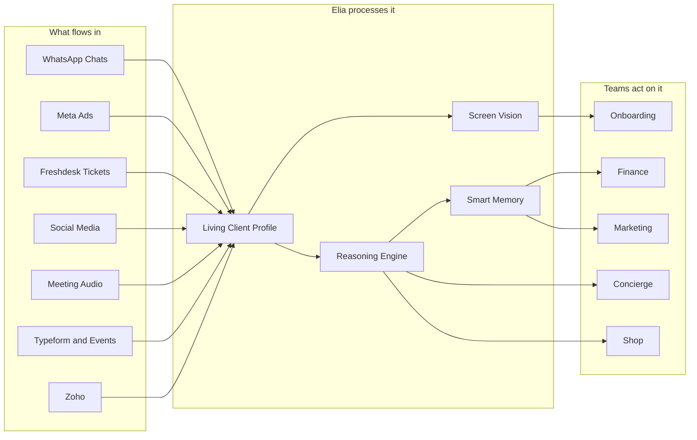
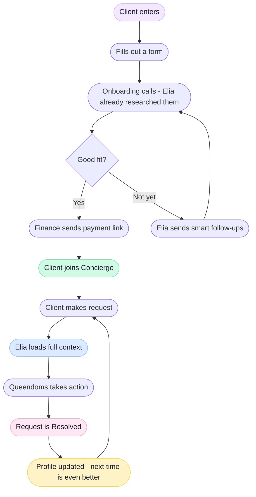

# Elia — By Indulge

> *Every client remembered. Every team supported. Every detail handled.*
> 

---

## What Elia Is

Elia is not a chatbot. She is the intelligence layer that sits quietly behind every team at Indulge Group — reading, learning, and making every interaction sharper than the last.

She works so the team can focus on what they do best: delivering extraordinary experiences.

> - **Live Client Context** — She reads past conversations, preferences, and history so every agent always sounds prepared from the first word.
> 

> - **Checklist Intelligence** — Tasks get created. Deadlines get flagged. Quality gets checked. Automatically.
> 

> - **Last Mile Guidance** — From first call to final delivery, Elia guides each department through every required step.
> 

---

## Chapter I — The Intelligence Layer

*Elia is only as good as the data she sees. Here is every signal that flows into her — and what she builds with it.*

---

## Chapter II — The Client Journey

*From the first ad click to a lifelong luxury relationship. This is the complete arc Elia guides every client through.*

---

## Chapter III — The Memory That Compounds

> **Elia remembers everything — so every experience gets better over time.**
> 

> The more your team uses it, the smarter it gets. Day 1 is good. Year 1 is extraordinary.
> 

| **Time** | **What Elia Knows** |
| --- | --- |
| First call | Lead background, company, online presence |
| First ticket | Preferences, budget, communication style |
| 3 tickets | Favourite vendors, recurring patterns, lifestyle |
| 6 months | Milestone dates, surprise preferences, trusted relationships |
| 1 year | A complete luxury profile — better than any human memory |

---

## Chapter IV — What Every Team Gets

*Elia is not just a Concierge tool. Every department in Indulge Group has a chapter in this story.*

> 👑  **Concierge** — Open the chapter below for the full picture.
> 

> 🎯  **Onboarding** — Smarter first calls. Elia researches the lead before your agent picks up the phone.
> 

> 🃏  **Joker** — Personalised recommendations generated from the client's actual life — not guesswork.
> 

> 💳  **Finance** — Payments tracked and approved automatically. No chasing. No missed reimbursements.
> 

> 🛍️  **Shop** — Orders from WhatsApp and Instagram routed and tracked without manual work.
> 

> 📣  **Marketing** — Content calendar, campaign performance, and briefs — all in one place.
> 

> ⚙️  **Tech** — System health monitored 24/7. Alerts before agents even notice something is off.
> 

> 📖  **Legacy** — Client stories structured and archived into a beautiful 5-generation book.
> 

---

## The Full Story

> 📖 F*rom the first WhatsApp message to the final delivery, and everything that runs beneath it, Elia will supercharge each task.*
> 

---

### Chapter 1 — The Concierge

*Elia's deepest integration. From the moment a client sends a WhatsApp to the moment the team taps send on a polished reply. Step by step, inside the most demanding workflow in the business.*

[Concierge](Elia%20%E2%80%94%20By%20Indulge/Concierge%20356128b7f3518198ada6f9498e840173.md)

Click to open the page

---

### Chapter 2 — Across Indulge Group

*Eight departments. One intelligence layer. This is what Elia does for every team, from Onboarding to Legacy, and how it all connects to a single, secure brain.*

[Across Indulge Group](Elia%20%E2%80%94%20By%20Indulge/Across%20Indulge%20Group%20356128b7f351812ab58efdbe00bebca2.md)

Click to open the page

---

### Chapter 3 — The Engine Room

*Every data flow. Every security boundary. Every architectural decision. The complete technical map of how Elia works under the hood.*

[Architecture — The System Map](Elia%20%E2%80%94%20By%20Indulge/Architecture%20%E2%80%94%20The%20System%20Map%20356128b7f35181b794a7e6ba536e5c2b.md)

Click to open the page

# The Plan

---

- 01 — Vision & Problem Statement
    
    ## The Problem
    
    Luxury concierge is a memory game. Agents toggle between a CRM, WhatsApp, spreadsheets, and their own recall to serve UHNI clients who expect the world to already know them.
    
    Every time an agent has to ask a client what they already told someone else, trust erodes.
    
    ## The Insight
    
    The information already exists inside Indulge — in WhatsApp threads, lead dossiers, activity timelines, and task remarks. It's just fragmented. No single agent can hold it all in their head.
    
    ## What Elia Is
    
    > Elia is a persistent AI copilot that reads the agent's screen, surfaces the right client context at the right moment, and autonomously routes requests across the company — without the agent having to ask.
    > 
    
    She is not a chatbot. She is an always-on intelligence layer.
    
    ## Before vs. After
    
    | Without Elia | With Elia |
    | --- | --- |
    | Agent opens lead dossier, scans manually | Elia reads screen, loads full client profile instantly |
    | Agent browses vendor sites blind | Elia audits live for conflicts with client constraints |
    | Agent writes Slack messages to coordinate | Elia routes the request to the right team automatically |
    | Client preferences live in WhatsApp history | Elia ingests and embeds them — searchable in seconds |
    | Managers ask for updates | Elia generates status reports from task data |
    
    ## One-Line Mission
    
    > Transform fragmented luxury operations into a seamless, hyper-personalized client experience — powered by an AI that never forgets and always acts.
    > 
- 02 — Atlas OS Foundation
    
    ## What Elia Sits On
    
    Elia is not a standalone tool. She is the intelligence layer on top of **Indulge Atlas** — our bespoke Company Operating System.
    
    ## Atlas at a Glance
    
    | Layer | Technology | What It Does |
    | --- | --- | --- |
    | Database | Supabase (PostgreSQL 15) | Multi-tenant, row-level isolated business data |
    | Auth | Supabase Auth (PKCE) | JWT sessions + profile-based role resolution |
    | Realtime | Supabase Realtime | Live task/lead updates to UI without polling |
    | Task Engine | Atlas Omni-Task (migrations 067–080) | Master / Subtask / Personal tasks with rich workflow |
    | Access Control | RLS + SECURITY DEFINER functions | Every query checked against `profiles` table — never JWT |
    | Webhooks | Pabbly → Next.js API routes | Lead ingestion from Meta, Google, Website, WhatsApp |
    | Edge Layer | Next.js 16 App Router | Full-stack monolith on Vercel |
    
    ## The Four Business Domains
    
    > Elia has read access across all domains. She can orchestrate a request that starts in Concierge and routes to Shop and Finance — something no single agent can do today.
    > 
    - **Indulge Concierge** — Luxury lifestyle concierge & primary inbound sales
    - **Indulge Shop** — E-commerce & product sourcing
    - **Indulge House** — Property & lifestyle experiences
    - **Indulge Legacy** — Long-term membership & legacy client management
    
    ## Why This Foundation Matters for Elia
    
    Most AI assistants bolt onto weak infrastructure. Elia's context is already structured:
    
    - Client profiles, tags, deal values, WhatsApp threads — all in Supabase
    - Task assignments and progress — tracked via Atlas Omni-Task
    - Cross-domain RLS means Elia's service role can read everything — agents can only read their slice
    
    **Elia doesn't need to guess. The data is already there. She just needs to read it.**
    
- 03 — Core Capabilities
    
    ## The Four Superpowers
    
    ### 1. Instant Auto-Context
    
    When an agent opens any lead, ticket, or client dossier, Elia reads the screen and assembles the complete client profile in seconds.
    
    **What she surfaces:**
    
    - Past requests and preferences (from WhatsApp + Freshdesk ingestion)
    - Current task status across all departments
    - Deal value, risk flags, last interaction
    - Relevant vendor history
    
    > No prompt needed. Elia activates on page load.
    > 
    
    ### 2. Live Vendor Auditing
    
    When an agent browses any external vendor site (yacht charters, hotels, private aviation), Elia scans the page in real-time and cross-references it against the client's constraints.
    
    **Flags she raises:**
    
    - Price out of stated budget range
    - Destination conflicts with known travel restrictions
    - Vendor previously rejected by client
    - Availability conflicts with known client schedule
    
    ### 3. Agentic Workflow Orchestration
    
    Elia turns a natural language request into a structured, checklist-driven workflow — then routes sub-tasks to the right department automatically.
    
    **Example flow:**
    
    > Agent: "Book a 3-night yacht for Aryan Shah in Santorini, second week of July."
    > 
    
    Elia creates:
    
    - Concierge sub-task: Curate 3 yacht options matching profile
    - Shop sub-task: Source any on-board gifting
    - Finance sub-task: Prepare pro forma invoice
    - Legacy sub-task: Log as itinerary in client record
    
    All tracked in Atlas. No Slack coordination required.
    
    ### 4. Silent Enrichment
    
    Elia continuously improves client profiles in the background — without any agent action.
    
    **Enrichment sources:**
    
    - Daily scraping of client social media (via Apify + Proxycurl)
    - Offline transcription of meeting audio (Whisper on AWS GPU)
    - WhatsApp thread ingestion and embedding (pgvector)
    - Freshdesk ticket history parsing
- 04 — Agent Interfaces
    
    ## Two Surfaces. One Intelligence.
    
    ### Desktop — The Always-On Chrome Extension
    
    **How it works:**
    
    1. Agent installs the Elia Chrome Extension
    2. Elia sits silently in the corner — a subtle floating panel
    3. When the agent opens any Atlas lead or browses any vendor site, Elia activates
    4. Context loads automatically — no prompt, no click
    
    **Key interactions:**
    
    | Trigger | Elia's Response |
    | --- | --- |
    | Opens lead dossier | Loads full client profile + active tasks + last interaction |
    | Browses yacht/hotel/aviation site | Audits page live, flags conflicts in sidebar |
    | Agent types a request | Converts to agentic workflow with sub-tasks + department routing |
    | Client asks about past interaction | Elia searches embedded WhatsApp/Freshdesk history |
    
    **Tech under the hood:**
    
    - Gemini 3.1 Flash for continuous DOM/screen reading (cheap, fast)
    - Claude 4.6 Sonnet for reasoning and workflow generation (triggered only when needed)
    - Extension communicates with Atlas API endpoints for context retrieval
    
    ### Mobile — The Floating Assistant
    
    > On mobile, Elia is not a Chrome Extension. She lives inside the Atlas mobile web app as a persistent floating interface.
    > 
    
    **How it works:**
    
    1. A floating pill sits at the bottom of the screen while the agent works
    2. Tapping it opens an intelligent bottom sheet covering 80% of the screen
    3. Elia reads the active ticket/lead behind the sheet
    4. Pins the client's key constraints at the top
    5. Presents a **1-tap "Approve & Execute"** button for any pending workflow action
    
    **Why this works on mobile:**
    
    - No extension required — native web UI
    - Context is read from the current Atlas page URL and session
    - Approve & Execute pattern means complex coordination happens in one tap
    - Bottom sheet dismisses cleanly — agent is back in their lead in under 3 seconds
    
    ## Agent Experience Principles
    
    - **Zero friction**: Elia never requires a prompt to activate
    - **Trust first**: All agentic actions require human approval before execution
    - **Minimal UI**: Elia surfaces only what's relevant — not everything she knows
    - **Speed**: Context loads in under 2 seconds from page open
- 05 — Hybrid Tech Stack & Architecture
    
    ## The Stack
    
    | Category | Component | Role | Est. Monthly Cost |
    | --- | --- | --- | --- |
    | Main Brain | Claude 4.6 Sonnet + Haiku | High-level reasoning, agentic workflows, intent | $580 – $1,280 |
    | Screen Vision | Gemini 3.1 Flash | Continuous DOM scanning, live vendor auditing | $150 – $300 |
    | Database | Supabase Pro (Postgres + pgvector) | Relational data, JSONB, vector embeddings | $95 – $175 |
    | Cache | Upstash Redis | Semantic caching — avoids duplicate AI queries | $20 – $60 |
    | Embeddings | Jina v3 API | Converting text to searchable vectors | $15 – $45 |
    | Enrichment | Apify + Proxycurl | Daily social scraping of HNI client profiles | $99 – $200 |
    | Voice (TTS) | ElevenLabs | Custom low-latency voice for Elia Avatar | $99 – $330 |
    | Transcription | AWS EC2 g5.xlarge (Spot) + Whisper | Meeting audio → text, offline | $120 – $300 |
    | Infra | AWS EKS + EC2 + S3/CDN | Server clusters, load balancing, file storage | $250 – $430 |
    | Security | AWS KMS + WAF | Data encryption and firewall | $25 – $55 |
    | Dev Tooling | Cursor IDE + Apple/Windows Certs | Development and OS-level app signing | $120 – $150 |
    | **TOTAL** |  |  | **$1,573 – $3,325/mo** |
    
    ## Why Hybrid AI?
    
    > We do not use one model for everything. We use the cheapest capable model for each job.
    > 
    - **Gemini 3.1 Flash** runs continuously in the Chrome Extension, scanning DOM changes. It costs a fraction of a heavyweight model.
    - **Claude 4.6** wakes up only when Gemini detects something requiring real reasoning — a vendor conflict, a complex routing decision, a client preference synthesis.
    - **Upstash Redis** caches identical semantic queries. If two agents look up the same client in 10 minutes, the second call is instant and free.
    
    ## Infrastructure Notes
    
    - All client data is encrypted at rest via **AWS KMS**
    - Vectors stored in **pgvector** within Supabase — no third-party vector DB
    - Whisper runs on **Spot GPU instances** — meeting transcription is async, not real-time
    - The Chrome Extension communicates only with our own Atlas API endpoints — never directly with Claude or Gemini
- 06 — Delivery Roadmap
    
    ## Three Phases. 90 Days.
    
    ### Phase 1 — Data Engine (Day 0 → Day 15)
    
    **Goal**: Every past client interaction is searchable in seconds.
    
    **Deliverables:**
    
    - Ingest historical WhatsApp threads into Supabase JSONB + pgvector
    - Ingest historical Freshdesk tickets (parsing, cleaning, embedding)
    - Vendor data initial load
    - Chat interface for Elia — query client history in natural language
    
    **Testable Milestone:**
    
    > You can open a chat interface and ask: *"What did Aryan Shah say about his yacht preferences last March?"* — and get an accurate answer in under 3 seconds.
    > 
    
    **Tech Tasks:**
    
    | Task | Owner | Status |
    | --- | --- | --- |
    | WhatsApp ingestion pipeline | Tech | Planned |
    | Freshdesk API integration | Tech | Planned |
    | Jina v3 embedding batch job | Tech | Planned |
    | pgvector schema extension | Tech | Planned |
    | Basic Elia chat UI | Tech | Planned |
    
    ### Phase 2 — The Copilot Extension (Day 16 → Day 30)
    
    **Goal**: Agents have a live AI copilot on their screen.
    
    **Deliverables:**
    
    - Chrome Extension (MV3) with Gemini Flash DOM scanner
    - Auto-context loading on lead/ticket open
    - Live vendor auditing (conflict flagging)
    - Claude-powered reasoning layer (triggered by Gemini)
    - 1-tap Approve & Execute for agentic workflows
    - Mobile floating assistant (Atlas web app)
    
    **Testable Milestone:**
    
    > An agent browses a yacht charter site. Elia flags: *"Client's stated budget is $40K. This vessel is $65K/week."* — without the agent asking.
    > 
    
    ### Phase 3 — Agentic Orchestration (Day 31 → Day 90)
    
    **Goal**: Elia handles 95% of cross-department coordination autonomously.
    
    **Deliverables:**
    
    - Full agentic workflow engine (Master Task creation from natural language)
    - Cross-domain routing (Concierge → Shop → Finance → Legacy)
    - Silent enrichment (Apify social scraping + Whisper meeting transcription)
    - ElevenLabs voice layer for Elia Avatar
    - Manager briefing generation from Atlas task data
    
    > Phase 3 cash demand rises to $1,500 – $3,000/mo. Phase 1 & 2 operate within $800 – $1,200/mo.
    > 
- 07 — Financial Projections
    
    ## OPEX Summary
    
    | Phase | Monthly Spend | What It Covers |
    | --- | --- | --- |
    | Phase 1 (Day 0–15) | $800 – $1,200 | Dev tooling, Supabase Pro, embedding tests, basic AI usage |
    | Phase 2 (Day 16–30) | $800 – $1,200 | Extension infra, Gemini vision, Claude reasoning, Redis cache |
    | Phase 3 (Steady State) | $1,500 – $3,000 | Full stack running cost (all components live) |
    
    ## Full Component Breakdown (Steady State)
    
    | Component | Low | High |
    | --- | --- | --- |
    | Claude 4.6 Sonnet + Haiku | $580 | $1,280 |
    | Gemini 3.1 Flash | $150 | $300 |
    | Supabase Pro | $95 | $175 |
    | Upstash Redis | $20 | $60 |
    | Jina v3 Embeddings | $15 | $45 |
    | Apify + Proxycurl (enrichment) | $99 | $200 |
    | ElevenLabs (TTS) | $99 | $330 |
    | AWS EC2 GPU (Whisper) | $120 | $300 |
    | AWS EKS + EC2 + S3 | $250 | $430 |
    | AWS KMS + WAF | $25 | $55 |
    | Cursor IDE + Certs | $120 | $150 |
    | **TOTAL** | **$1,573** | **$3,325** |
    
    ## Cost Controls Built In
    
    > We cap AI spend using three mechanisms:
    > 
    1. **Semantic caching via Upstash Redis** — identical or near-identical queries return cached results. Duplicate client lookups cost $0.
    2. **Hybrid model routing** — Gemini Flash (~$0.0001/page scan) runs continuously. Claude (~$0.003/1K tokens) activates only on reasoning tasks.
    3. **Spot GPU instances** — Whisper transcription runs on AWS Spot EC2, reducing GPU costs by 60–70% vs. on-demand.
    
    ## What We Are Not Paying For
    
    - No dedicated vector database (pgvector is free within Supabase)
    - No separate backend service (Elia calls Atlas API routes — no new infra)
    - No per-seat AI licensing (usage-based only)
- 08 — Security & Compliance
    
    ## The Vault
    
    Elia handles UHNI (Ultra High Net Worth Individual) client data. The security posture is non-negotiable.
    
    ## Data Architecture
    
    | Layer | Mechanism | Guarantee |
    | --- | --- | --- |
    | Database | Supabase PostgreSQL + RLS | Row-level isolation — agent X cannot see client of agent Y |
    | Auth | Supabase Auth PKCE | Short-lived JWT sessions, HTTP-only cookies |
    | Role Resolution | `get_user_role()` from `profiles` table | JWT claims never trusted for authorization |
    | Encryption at Rest | AWS KMS | All client PII encrypted before storage |
    | Encryption in Transit | TLS 1.3 everywhere | Extension → Atlas API → Supabase |
    | WAF | AWS WAF | Rate limiting, bot protection, geo-blocking |
    | AI Data Handling | Anonymized context only | Raw PII never sent to Claude or Gemini APIs |
    
    ## The RLS Invariant
    
    > ⚠️ This is a load-bearing security rule. It must never regress.
    > 
    
    `get_user_role()`, `get_user_domain()`, and `get_user_department()` read **only from `public.profiles`**. JWT claims are never trusted for authorization. All SECURITY DEFINER functions have `SET search_path = public`.
    
    ## Elia's Permission Scope
    
    | Action | Elia's Access |
    | --- | --- |
    | Read client profile | ✅ Service role — cross-domain |
    | Read task data | ✅ Service role |
    | Read WhatsApp threads | ✅ Service role |
    | Create tasks | ✅ On behalf of authenticated agent |
    | Send WhatsApp messages | ❌ Agent must approve first |
    | Delete any record | ❌ Never |
    | Access other workspace's data | ❌ Scoped to Indulge Group only |
    
    ## What Leaves the Vault
    
    **Nothing raw.** When Elia calls Claude or Gemini:
    
    - Client names are pseudonymized (internal UUID reference only)
    - Sensitive financial figures are replaced with ranges
    - Location data is abstracted to region level
    - Responses are re-hydrated with real data only inside our secure API layer
    
    ## Audit Trail
    
    Every Elia action writes to `lead_activities` (immutable, append-only). No UPDATE or DELETE policies. Ever. All agent approvals are logged with actor_id, timestamp, and action payload.
    
- 09 — KPIs & Success Metrics
    
    ## How We Know Elia Is Working
    
    ### Phase 1 KPIs (Data Engine)
    
    | Metric | Target | Measurement |
    | --- | --- | --- |
    | WhatsApp threads ingested | 100% of historical data | Row count in `whatsapp_messages` vs. source export |
    | Freshdesk tickets embedded | 100% | Embedding job completion log |
    | Query accuracy | > 90% relevant results | Manual spot-check: 50 queries, 2 reviewers |
    | Query latency | < 3 seconds (p95) | Supabase query logs |
    
    ### Phase 2 KPIs (Copilot Extension)
    
    | Metric | Target | Measurement |
    | --- | --- | --- |
    | Context load time | < 2 seconds from page open | Extension performance logs |
    | Vendor conflict detection accuracy | > 85% precision | Manual audit: 20 vendor browsing sessions |
    | Agent activation rate | > 70% of agents using Elia daily by Day 30 | Extension telemetry |
    | False positive rate (conflict flags) | < 15% | Agent feedback thumbs down |
    
    ### Phase 3 KPIs (Agentic Orchestration)
    
    | Metric | Target | Measurement |
    | --- | --- | --- |
    | Manual coordination messages eliminated | > 60% reduction in Slack cross-dept messages | Slack analytics (baseline vs. after) |
    | Task creation time | < 30 seconds for a full multi-dept workflow | Elia session logs |
    | Agentic workflow approval rate | > 80% (agents approve Elia's proposals without editing) | Atlas task audit log |
    | Client profile completeness | > 90% of active clients have enriched profiles | `profiles` completeness score query |
    
    ### Ongoing Health Metrics
    
    | Metric | Alert Threshold |
    | --- | --- |
    | Claude API error rate | > 2% → PagerDuty alert |
    | Gemini scan latency | > 5 seconds → investigate |
    | Redis cache hit rate | < 40% → review caching strategy |
    | Monthly AI spend | > $2,800 → cost review |
    | Elia-generated task accuracy | < 75% → retune prompts |
- 10 — Decision Log
    
    ## Architecture Decisions & Rationale
    
    A living record. Add a row for every significant technical or product decision.
    
    | Decision | Chosen Approach | Rejected Alternatives | Rationale |
    | --- | --- | --- | --- |
    | AI Model Strategy | Hybrid: Gemini Flash (vision) + Claude 4.6 (reasoning) | Single model for everything | Cost: Gemini scans cost 30x less than Claude per page. Claude activates only when reasoning is required. |
    | Vector Storage | pgvector inside Supabase | Pinecone, Weaviate, Qdrant | One fewer external service. RLS applies to vectors too. Data never leaves our DB. |
    | Mobile Interface | Floating bottom sheet in Atlas web app | Native iOS/Android app | Speed to market. Atlas is already a web app. Native app = 3–4 months extra. |
    | Agent Approval Model | All agentic actions require 1-tap human approval | Full autonomy | UHNI clients. Trust is paramount. Elia proposes; agents approve. |
    | Data Privacy for AI Calls | Pseudonymize before sending to Claude/Gemini | Send raw data | UHNI data cannot leave our vault in identifiable form. Regulatory and reputational risk. |
    | Transcription Engine | Whisper on AWS Spot GPU | Deepgram, AssemblyAI | One-time compute, no per-minute cost, data stays in our AWS account. |
    | Enrichment Source | Apify + Proxycurl | Manual research | Scalable. Agents cannot enrich 200+ profiles manually. Automated daily updates. |
    | Extension Architecture | Chrome Extension MV3 + Atlas API | Standalone extension with its own backend | Elia's context is in Atlas. Extension reads the DOM and calls Atlas API routes — no duplicate backend. |
    | Cost Control | Semantic caching (Upstash) + hybrid routing | Token budgets | Caching eliminates duplicate spend. Hybrid routing ensures we only pay for heavyweight reasoning when needed. |
    | Audit Trail | `lead_activities` (append-only) | Separate Elia log table | Already exists. Immutable by policy. Every Elia action is attributable to an agent + timestamp. |
    
    > **How to use this log**: Before implementing any major change to Elia's architecture, add a row here first. Describe what you're changing and why. This is the institutional memory of how Elia was built.
    >