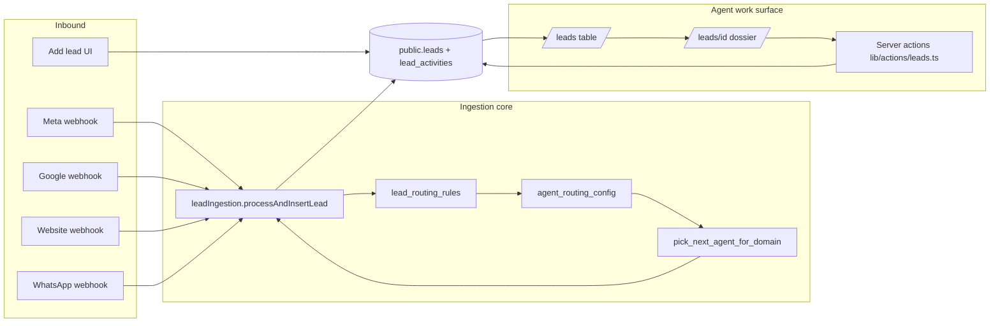

# Indulge Atlas — Onboarding & CRM workflow

> **Purpose**: Single reference for how inbound leads enter Atlas, how the onboarding/concierge team works them through the pipeline, and how that maps to code, data, and UI.  
> **Scope**: CRM lead lifecycle first; related systems (tasks, WhatsApp, manager tools, internal conversion ledger) are included where they touch this path.  
> **Last synthesized**: 2026-05-04 (from repository scan — re-run the regeneration prompt below after major migrations or refactors).

---

## 1. Product narrative

Indulge Atlas began as a **CRM for the onboarding team**: marketing and inbound channels push prospects into one system, agents pick them up, and records move through a **defined journey** toward **conversion** (won deal / nurture / lost / trash).

**Channels (today’s wiring)**:

| Channel | Typical path | Code entry |
|--------|----------------|------------|
| **Meta** (Lead Ads, Pabbly) | Form fill → webhook | `POST /api/webhooks/leads/meta` |
| **Google** | Lead form extensions → webhook | `POST /api/webhooks/leads/google` |
| **Website** (Typeform, Webflow, flat JSON) | Submit → webhook | `POST /api/webhooks/leads/website` |
| **WhatsApp** | Inbound message → match existing lead by phone or create lead | `POST /api/webhooks/whatsapp` (uses same ingestion core as Meta for *new* numbers) |
| **Manual / UI** | Agent or manager creates a row | Server action in `lib/actions/createLead.ts` (`AddLeadModal`) |

**After entry**:

1. Payload is validated, **sanitized**, phone **normalized to E.164**.
2. **Assignment**: dynamic `lead_routing_rules` → then `agent_routing_config` (shift + daily cap) → Postgres **`pick_next_agent_for_domain`** round-robin.
3. Row inserted into **`public.leads`** with `status = 'new'`, optional `assigned_to`, `is_off_duty` flag for SLA math.
4. **`lead_activities`** records `lead_created`.
5. Agents work leads from **`/leads`** (table) and **`/leads/[id]`** (dossier): status changes, notes, tasks, WhatsApp, internal chat, collaborators, won/lost/nurture/trash flows.

**“Onboarding” in two senses**:

- **Operational onboarding** = the whole CRM motion above.
- **`onboarding_leads` table** = a **separate internal ledger** of conversion events (client name, amount, agent name, assignee bucket), fed by **`/api/webhooks/onboarding-conversion`** or admin UI — not the same row as `public.leads`.

---

## 2. End-to-end flow (diagram)



---

## 3. Webhook & API routes (lead-related)

| Route | Role |
|-------|------|
| `app/api/webhooks/leads/meta/route.ts` | Bearer verify, rate limit, optional field mappings, `processAndInsertLead(..., "meta")` |
| `app/api/webhooks/leads/google/route.ts` | Same pattern for Google-shaped payloads |
| `app/api/webhooks/leads/website/route.ts` | Flat JSON / Typeform-style → `processAndInsertLead(..., "website")` |
| `app/api/webhooks/leads/route.ts` | Health `GET`; `POST` **410** — directs callers to meta/google/website |
| `app/api/webhooks/whatsapp/route.ts` | Signature verification, dedupe by `wa_message_id`, attach or create lead, `whatsapp_messages` |
| `app/api/webhooks/onboarding-conversion/route.ts` | Bearer `ONBOARDING_CONVERSION_WEBHOOK_SECRET` → `onboarding_leads` insert |
| `app/api/webhooks/ads/route.ts` | Ads-related (campaign side; not the same as lead row insert) |

Supporting utilities: `lib/utils/webhook.ts` (Bearer), `lib/utils/rateLimit.ts`, `lib/services/webhookLog.ts`, `lib/services/fieldMappingEngine.ts`.

---

## 4. Services (non–UI data layer)

| Module | Responsibility |
|--------|------------------|
| `lib/services/leadIngestion.ts` | Zod `leadPayloadSchema`, sanitize strings + `sanitizeFormData`, `normalizeToE164`, `resolveAssignedAgent`, insert `leads` + `lead_activities`, IST off-duty flag |
| `lib/services/evaluateRoutingRules.ts` | Pure evaluation of `LeadRoutingRule[]` against payload |
| `lib/services/agentRoutingConfig.ts` | Load active rows from `agent_routing_config` |
| `lib/services/fieldMappingEngine.ts` | Webhook-specific field transforms (used by adapters) |
| `lib/services/webhookLog.ts` | Async logging of raw payloads to `webhook_logs` |
| `lib/onboarding/onboardingConversion.ts` | Parse + insert **onboarding_leads** (JSON or FormData) |

---

## 5. Database tables (public schema — from migrations)

> **Note**: Atlas has many migrations; tables below are those created via `CREATE TABLE` in the tracked migration set. Other objects (views, RPCs, enum tweaks) exist — always check `supabase/migrations/` for the source of truth.

**Core CRM**

- `profiles` — users synced with auth; `role`, `domain`, `department`, routing flags (`is_on_leave`, etc.).
- `leads` — canonical pipeline row (status, assignment, UTM, `form_data` JSONB, scratchpad, follow-up drafts, tags, disposition fields, SLA flags).
- `lead_activities` — append-only timeline (`action_type`, `details`, legacy `type`/`payload` dual-write where applicable).
- `lead_collaborators` — explicit grants for cross-domain dossier access.
- `tasks` — work items; often `lead_id` FK (agent follow-ups).
- `campaign_metrics`, `campaign_drafts` — marketing / manager campaign layer; `utm_campaign` on leads relates to campaign identity.

**Routing & integrations**

- `lead_routing_rules` — conditional assign / route-to-domain.
- `agent_routing_config` — per-agent domain, shift window (IST), daily new-lead cap, priority.
- `webhook_logs` — raw inbound audit.
- `webhook_endpoints`, `field_mappings` — dynamic field mapping configuration.
- `whatsapp_messages` — thread storage keyed to `lead_id`.

**Messaging (internal)**

- `conversations`, `conversation_participants`, `messages` — chat system (including lead-context threads).

**Projects / tasks (parallel OS surface)**

- `projects`, `project_members`, `task_groups`, `group_task_members`, `task_comments`, `task_progress_updates`, `task_remarks`, `task_notifications`, `import_batches`.

**Shop workspace**

- `shop_orders`, `shop_master_targets`, `shop_target_updates`.

**Clients (post-sale / membership)**

- `clients`, `client_profiles`, `profile_sources` — richer client record; `lead_origin_id` can tie back to CRM.

**Internal onboarding conversion ledger**

- `onboarding_leads` — **not** a duplicate of `leads`; stores conversion summary rows for TV/admin (`assigned_to` constrained to specific onboarding names in migration 052).

**Other**

- `personal_todos`, `user_scratchpad_notes`.

**Important Postgres functions (examples)**

- `pick_next_agent_for_domain` — round-robin agent pick (optionally restricted UUID list from app layer).
- `get_user_role()` / domain helpers — RLS and auth (see migrations 058+); authorization must follow **`profiles`**, not JWT claims alone.

---

## 6. Types (`lib/types/database.ts`) — CRM-relevant excerpts

Hand-maintained types must match Postgres enums.

- **`LeadStatus`**: `new` → `attempted` → `connected` → `in_discussion` → terminal: `won` \| `nurturing` \| `lost` \| `trash`.
- **`LEAD_STATUS_ORDER`**, **`LEAD_STATUS_CONFIG`** — UI labels, colors, descriptions.
- **`IndulgeDomain`**, **`EmployeeDepartment`** — data tenant vs org chart / nav (`onboarding` is a department constant alongside `concierge`, `finance`, etc.).
- **`UserRole`**, **`isPrivilegedRole`** — UI/RLS helpers (**note**: `lib/actions/leads.ts` uses a local `isPrivilegedRole` that also treats **`manager`** as privileged for lead mutations; `database.ts`’s `isPrivilegedRole` is stricter — keep both in mind when auditing access).
- **`Lead`**, **`LeadActivity`**, **`LeadCollaborator`**, **`CampaignMetric`**, **`WhatsAppMessage`**, **`LeadRoutingRule`**, **`AgentRoutingConfig`** — table-aligned interfaces.
- **`Database`** generic — Supabase client typing for `public` tables (subset of real schema; may lag migrations).
- **`LostReason`**, **`LostReasonTag`**, **`TrashReason`**, **`NurtureReason`** — modal disposition sets.

Full file: `lib/types/database.ts` (~1300+ lines) also covers tasks, projects, clients, notifications, task intelligence DTOs, etc.

---

## 7. Server actions — lead pipeline

**Primary file**: `lib/actions/leads.ts`

| Function | Purpose |
|----------|---------|
| `getLeadActivities` | Timeline rows for dossier |
| `updateLeadStatus` | Pipeline transition + activity log |
| `markAttemptedAndScheduleRetry` | Attempt counting / nurture edge (see implementation) |
| `addLeadNote` | Notes + activity |
| `updateLeadDemographics` | City/persona-style fields |
| `updateLeadEmail` | Email correction |
| `updateLeadTags` | Tag array |
| `markLeadSLAAlertSent` | SLA acknowledgement flags |
| `markLeadTrash` / `markLeadLost` / `markLeadNurturing` | Terminal / nurture paths with reasons |
| `markLeadLostLegacy` | Older lost flow |
| `saveAgentScratchpad` | Private agent notes |
| `saveLeadFollowUpDrafts` | Follow-up accordion drafts |
| `reassignLead` | Change `assigned_to` |
| `closeWonDeal` | Won path + downstream (finance handoff per implementation) |
| `getDashboardData` | Agent dashboard bundle |

**Manual create**: `lib/actions/createLead.ts` — validated add from UI.

**Collaboration**: `lib/actions/leadCollaborators.ts` — grant/revoke dossier access.

**Onboarding ledger**: `lib/actions/onboarding-conversions.ts` — admin form → `insertOnboardingConversion`.

**Adjacent**: `lib/actions/whatsapp.ts`, `lib/actions/tasks.ts`, `lib/actions/messages.ts`, `lib/actions/campaigns.ts`, `lib/actions/manager-analytics.ts`, `lib/actions/pipeline.ts`, `lib/actions/clients.ts`.

---

## 8. UI routes (App Router)

| Path | File | Notes |
|------|------|--------|
| `/leads` | `app/(dashboard)/leads/page.tsx` | RSC: filters, pagination, domain rules, `LeadsTable`, `AddLeadModal` |
| `/leads/[id]` | `app/(dashboard)/leads/[id]/page.tsx` | **`force-dynamic`** dossier: status, SLA, inline edits, async islands |
| `/admin/onboarding` | `app/(dashboard)/admin/onboarding/*` | Oversight tabs (team, campaigns, etc.) — onboarding **department** tooling |
| `/admin/conversions` | (revalidated from onboarding actions) | Conversion / TV-adjacent surfaces |

---

## 9. Lead dossier composition

**Page**: `app/(dashboard)/leads/[id]/page.tsx` imports layout chrome (`TopBar`), status (`LeadStatusBadge`, `StatusActionPanel`), assignment (`InlineAgentSelect`), field editors (`InlineEmailEdit`, `InlineCityEdit`, `InlinePersonaEdit`, `InlineDossierFields`, `InlineTagsEdit`), marketing (`MarketingIntakeCard`, `LeadSourceBadge`), collaboration (`LeadCollaboratorsDock`), scratchpad (`AgentScratchpad`), SLA helpers (`getOffDutyAnchor`).

**Async data islands**: `app/(dashboard)/leads/[id]/LeadDossierAsync.tsx`

| Export | Loads | Renders |
|--------|--------|---------|
| `LeadDossierWhatsAppAsync` | `getWhatsAppMessagesForLead` | `WhatsAppChatModule` |
| `LeadDossierJourneyAsync` | `getLeadActivitiesForDossier` | `LeadJourneyBar` (stages from activities) |
| `LeadDossierTimelineAsync` | activities | `ActivityTimeline` |
| `LeadDossierTasksAsync` | `getLeadTasksForDossier` | `LeadTaskWidget` |
| `LeadDossierContextChatAsync` | `getOrCreateLeadConversationForDossier` | `LeadContextChat` |

**Journey math**: `lib/leads/leadJourneyStages.ts` — `aggregateLeadJourneyStages` filters `lead_created` + `status_changed`, computes dwell time per stage.

**Cached request helpers**: `lib/leads/leadDetailRequestCache.ts` — deduped fetches for RSC.

---

## 10. `components/leads/` — component index

| File | Role |
|------|------|
| `LeadsTable.tsx` | Main pipeline grid; sorting, status chips, links to dossier |
| `LeadsTableDateFilterPopover.tsx`, `ui/filter-trigger.tsx` | Filtering UX |
| `AddLeadModal.tsx` | Manual lead entry |
| `LeadStatusBadge.tsx` | Status pill |
| `StatusActionPanel.tsx` | Primary status actions on dossier |
| `InlineAgentSelect.tsx` | Reassign inline |
| `InlineEmailEdit.tsx`, `InlineCityEdit.tsx`, `InlinePersonaEdit.tsx`, `InlineDossierFields.tsx`, `InlineTagsEdit.tsx` | Inline field saves |
| `MarketingIntakeCard.tsx` | Campaign / UTM intake display |
| `DynamicFormResponses.tsx` | `form_data` key/value rendering |
| `ActivityTimeline.tsx` | Chronological feed |
| `LeadJourneyBar.tsx`, `LeadJourneyTimeline.tsx` | Visual journey |
| `LeadFollowUpAccordion.tsx` | Follow-up 1–3 + drafts |
| `AgentScratchpad.tsx` | Private notes |
| `WonDealModal.tsx`, `LostLeadModal.tsx`, `NurtureModal.tsx`, `TrashLeadModal.tsx` | Terminal state capture + reasons |
| `ConversionsTable.tsx` | Conversion-related table (context: admin/manager) |
| `LeadCollaboratorsDock.tsx`, `LeadCollaborationGrantListener.tsx` | Sharing UI + realtime listener |
| `dossier/WhatsAppChatModule.tsx` | WhatsApp panel |

---

## 11. Related surfaces (not exhaustive)

- **`components/manager/`** — Morning briefing, campaigns, roster, analytics; consumes manager actions and campaign data.
- **`components/layout/`** — `Sidebar`, `TopBar`, `NotificationBell` — navigation into leads/manager.
- **`lib/hooks/useSLA_Monitor.ts`** — client SLA breach awareness.
- **`lib/utils/sla.ts`** — `getOffDutyAnchor` shared with dossier SLA display.

---

## 12. Conventions (from project standards)

- **Writes**: Client components call **Server Actions** only — no direct Supabase writes from browser for mutations.
- **Sanitization**: `sanitizeText`, `sanitizeFormData` on external text / JSONB.
- **Phones**: `normalizeToE164` before persistence.
- **`components/ui/`** must not import `lib/actions/`.

---

## 13. Prompt to regenerate this document (full codebase scan)

Copy everything inside the fence below into a new AI session when you want an **updated** `onboarding_workflow.md` after schema or UI changes.

```text
You are documenting Indulge Atlas (Next.js App Router + Supabase).

Task:
1. Read and update the repo file `onboarding_workflow.md` (create if missing).
2. Preserve section 1 (product narrative) unless product direction changed; refresh all technical sections from the current repo.

Scan requirements (do all):
- List every `app/api/webhooks/**/route.ts` and summarize method, auth, and downstream service/action.
- Read `lib/services/leadIngestion.ts` end-to-end; document assignment order (routing rules → agent_routing_config → pick_next_agent_for_domain).
- Grep `supabase/migrations/*.sql` for `CREATE TABLE` / major `ALTER TABLE` on `leads`, `lead_activities`, routing, whatsapp, clients; group tables by domain (CRM, messaging, projects, shop, onboarding ledger).
- Read `lib/types/database.ts` for Lead, LeadStatus, LeadRoutingRule, AgentRoutingConfig, Profile, Database["public"]["Tables"] entries relevant to CRM.
- Enumerate `export async function` in `lib/actions/leads.ts`, `createLead.ts`, `leadCollaborators.ts`, `onboarding-conversions.ts`, `whatsapp.ts` (lead-related).
- Map `app/(dashboard)/leads/page.tsx` and `app/(dashboard)/leads/[id]/page.tsx` + `LeadDossierAsync.tsx`: list imported components and data sources.
- List every file in `components/leads/` with a one-line description.
- Note any drift between `isPrivilegedRole` in `lib/types/database.ts` vs local copies in server actions.
- Mention `DEPARTMENT_ROUTE_ACCESS` / onboarding routes if touched.
- Refresh **Section 15 (Journey inventory)** — pages, webhook routes, lib modules, server actions, and components on the lead path.

Output:
- Single markdown file, clear headings, mermaid flowchart for inbound→leads→dossier, tables for routes/actions/components.
- State the generation date and that types in `lib/types/database.ts` are hand-maintained.
```

---

## 14. Related internal docs

- `CLAUDE.md` — AI-oriented map and conventions.
- `ATLAS_BLUEPRINT.md` — deeper architecture reference (if present in repo).

---

## 15. Journey inventory — pages, components, libs, functions

Repo-accurate checklist for the **CRM lead path**: inbound → `public.leads` → list → dossier → tasks / WhatsApp / internal chat / disposition → agent dashboard. Parallel paths (e.g. `onboarding_leads` webhook, admin onboarding UI) are noted briefly.

### 15.1 Pages (App Router)

| Route | File | Role |
|-------|------|------|
| `/` | `app/(dashboard)/page.tsx` | Agent home: `getDashboardData()`, lead metric counts, `UnattainedLeadsQueue`, `PastLeadsList`, `ConversionHistory`; tasks via `getMyTasks`, `getAgentDailyRoster` |
| `/leads` | `app/(dashboard)/leads/page.tsx` | Lead directory RSC: filters, pagination, `LeadsTable`, `AddLeadModal`; loads `tasks` for “next task” column |
| `/leads/[id]` | `app/(dashboard)/leads/[id]/page.tsx` | Lead dossier (RSC + `Suspense`); local helpers `getSLAInfo`, `parseFollowUpDrafts` |
| *(shell)* | `app/(dashboard)/layout.tsx` | `Sidebar`, `LeadAlertProvider`, `ChatProvider`, `LeadCollaborationGrantListener`, SLA/profile providers, task reminders |
| Login | `app/(auth)/…` | Redirect when unauthenticated |

**Parallel / ledger (not the main `leads` row):** `app/(dashboard)/admin/onboarding/*`, `app/api/webhooks/onboarding-conversion/route.ts`, `app/api/tv/onboarding-feed/route.ts` when used.

### 15.2 API routes (inbound)

| Path | File |
|------|------|
| `POST …/leads/meta` | `app/api/webhooks/leads/meta/route.ts` |
| `POST …/leads/google` | `app/api/webhooks/leads/google/route.ts` |
| `POST …/leads/website` | `app/api/webhooks/leads/website/route.ts` |
| `GET` / deprecated `POST …/leads` | `app/api/webhooks/leads/route.ts` |
| `GET` / `POST …/whatsapp` | `app/api/webhooks/whatsapp/route.ts` |
| `POST …/onboarding-conversion` | `app/api/webhooks/onboarding-conversion/route.ts` |

### 15.3 `lib/` — services, utils, caches, hooks, schemas

| Area | Files / symbols |
|------|------------------|
| Ingestion | `lib/services/leadIngestion.ts` — `processAndInsertLead`; RPC `pick_next_agent_for_domain` |
| Routing | `lib/services/evaluateRoutingRules.ts`, `lib/services/agentRoutingConfig.ts` |
| Webhooks | `lib/services/fieldMappingEngine.ts` (`applyFieldMappings`), `lib/services/webhookLog.ts` (`enqueueWebhookLog`) |
| Supabase | `lib/supabase/service.ts` (webhooks / ingestion), `lib/supabase/server.ts` (RSC + actions) |
| Dossier cache | `lib/leads/leadDetailRequestCache.ts` — cached `getLeadActivities`, `getLeadTasks`, `getOrCreateLeadConversation` |
| Journey UI math | `lib/leads/leadJourneyStages.ts` — `aggregateLeadJourneyStages` |
| List select | `lib/leads/leadsTableSelect.ts` — `LEADS_TABLE_SELECT` |
| SLA | `lib/utils/sla.ts` — `getOffDutyAnchor` |
| Strings / UI | `lib/utils.ts` — `formatDateTime`, `getInitials`, `cn`; `lib/utils/time.ts`; `lib/utils/date-format.ts` |
| Webhook security | `lib/utils/webhook.ts`, `lib/utils/rateLimit.ts` |
| Phone / PII | `lib/utils/phone.ts`, `lib/utils/sanitize.ts` |
| Types | `lib/types/database.ts` — `Lead`, `LeadStatus`, collaborators, tasks, WhatsApp, etc. |
| Forms | `lib/schemas/lead.ts` — `addLeadSchema`, domain/source enums for add-lead |
| Hooks | `lib/hooks/useClientOnly.ts`, `useLeadCollaboratorsRealtime.ts`, `useMessages.ts` |
| Task alerts | `lib/task-alert-refresh.ts` — `dispatchTaskAlertAfterCompleteOrDelete` |
| Onboarding ledger | `lib/onboarding/onboardingConversion.ts` |

### 15.4 Server actions

**`lib/actions/leads.ts`:** `getLeadActivities`, `updateLeadStatus`, `markAttemptedAndScheduleRetry`, `addLeadNote`, `updateLeadDemographics`, `updateLeadEmail`, `updateLeadTags`, `markLeadSLAAlertSent`, `markLeadTrash`, `markLeadLost`, `markLeadNurturing`, `markLeadLostLegacy`, `saveAgentScratchpad`, `saveLeadFollowUpDrafts`, `reassignLead`, `closeWonDeal`, `getDashboardData`.

**`lib/actions/createLead.ts`:** `createLead`, `getAgentsForLeadForm`, `getCurrentUserProfile`.

**`lib/actions/leadCollaborators.ts`:** `addLeadCollaborator`, `listLeadCollaborators`, `removeLeadCollaborator`, `searchProfilesForCollaboration`.

**`lib/actions/tasks.ts` (journey-relevant):** `getLeadTasks`, `getMyTasks`, `getAgentDailyRoster`; dossier widget uses deprecated aliases **`createTask`** / **`completeTask`** (mapped to `createPersonalTask` / `completePersonalTask` in this repo).

**`lib/actions/messages.ts`:** `getOrCreateLeadConversation`, `sendMessage`, `markConversationRead`.

**`lib/actions/whatsapp.ts`:** `getWhatsAppMessagesForLead`, `sendWhatsAppMessage`.

**`lib/actions/onboarding-conversions.ts`:** `recordOnboardingConversionFromAdmin`.

**Same actions elsewhere:** `components/whatsapp/ActiveChatPanel.tsx` → `updateLeadStatus`; `components/sla/AgentSLAAlert.tsx` → `markLeadSLAAlertSent`; `components/sla/ScoutSLAAlerts.tsx` → `reassignLead`.

### 15.5 Components (grouped)

**Layout / shell:** `components/layout/Sidebar.tsx`, `TopBar.tsx`; `components/providers/LeadAlertProvider.tsx`, `TaskReminderProvider.tsx`, `TaskAlertProvider.tsx`, `CommandPaletteProvider.tsx`; `components/chat/ChatProvider.tsx`; `components/sla/ProfileProvider.tsx`, `SLAProvider.tsx`.

**`/leads`:** `LeadsTable.tsx`, `LeadsTableDateFilterPopover.tsx`, `ui/filter-trigger.tsx`, `AddLeadModal.tsx`, `LeadStatusBadge.tsx`; `components/ui/LeadSourceBadge.tsx`; shared UI (`button`, `input`, `select`, `skeleton`, `card`).

**`/leads/[id]`:** `app/(dashboard)/leads/[id]/LeadDossierAsync.tsx`; `StatusActionPanel.tsx`, `LeadFollowUpAccordion.tsx`, `InlineAgentSelect.tsx`, `InlineEmailEdit.tsx`, `InlineCityEdit.tsx`, `InlinePersonaEdit.tsx`, `InlineDossierFields.tsx`, `InlineTagsEdit.tsx`, `MarketingIntakeCard.tsx`, `ActivityTimeline.tsx`, `LeadJourneyBar.tsx`, `LeadCollaboratorsDock.tsx`, `LeadCollaborationGrantListener.tsx`, `AgentScratchpad.tsx`, `dossier/WhatsAppChatModule.tsx`, `components/chat/LeadContextChat.tsx`, `components/tasks/LeadTaskWidget.tsx` (+ dynamic `FollowUpModal.tsx`); modals `LostLeadModal.tsx`, `TrashLeadModal.tsx`, `NurtureModal.tsx`, `WonDealModal.tsx`, `components/modals/RetryScheduleModal.tsx`; UI primitives as imported on the page (`card`, `info-row`, `separator`, `scroll-area`, `sheet`, `indulge-button`, `avatar-stack`, `LuxuryDatePicker`, `dialog`, `label`, `textarea`).

**`/` dashboard:** `DashboardHero.tsx`, `UnattainedLeadsQueue.tsx`, `PastLeadsList.tsx`, `ConversionHistory.tsx`, `MyTasksWidget.tsx` (legacy), `components/tasks/MyTasksWidget.tsx`, `DailyRoster.tsx`.

**In `components/leads/` but not all mounted on dossier:** e.g. `DynamicFormResponses.tsx`, `EditDemographicsModal.tsx`, `ConversionsTable.tsx`, `LeadJourneyTimeline.tsx` — available for other routes or future wiring.

### 15.6 End-to-end chain (one paragraph)

Webhooks apply **Bearer/signature checks**, **rate limits**, optional **`applyFieldMappings`**, then **`processAndInsertLead`** writes **`leads`** + **`lead_activities`** (WhatsApp also writes **`whatsapp_messages`**). Agents use **`/`** or **`/leads`**, then **`/leads/[id]`**; dossier islands use cached reads for activities, tasks, conversations, and WhatsApp. Client widgets call the **server actions** listed above for status, notes, demographics, tags, reassignment, scratchpad, follow-up drafts, collaborators, tasks, messages, WhatsApp send, and won/lost/nurture/trash flows.

---

*This file is generated documentation; behavior is authoritative in source code and SQL migrations.*
